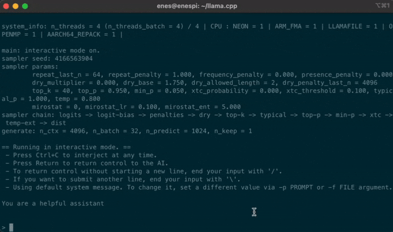
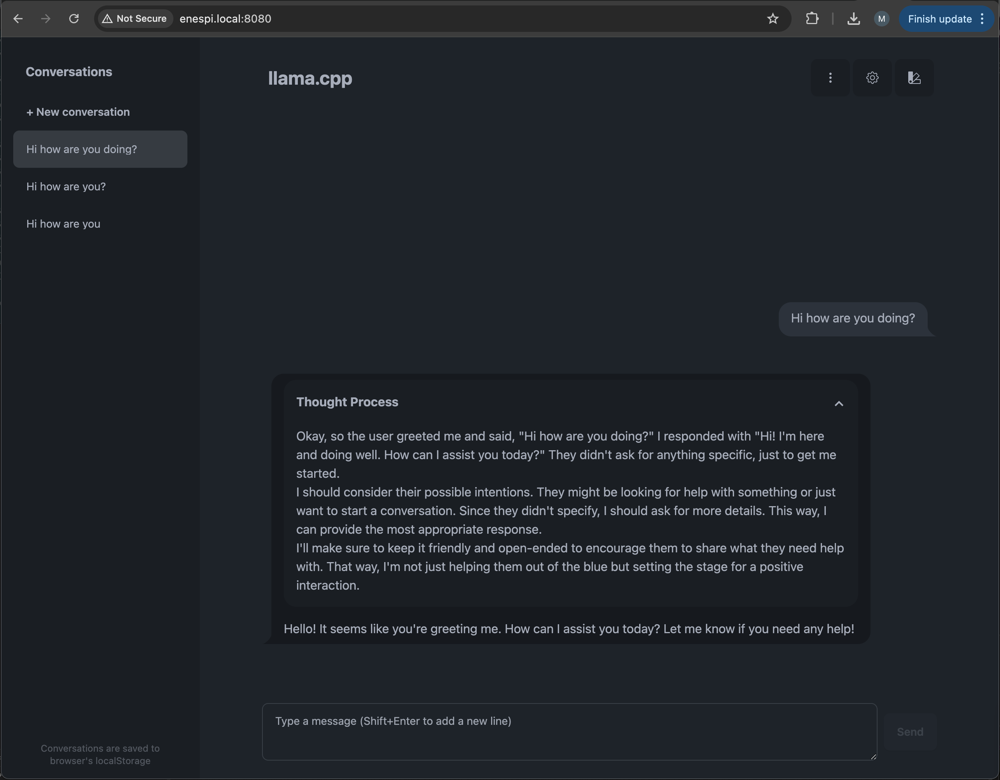
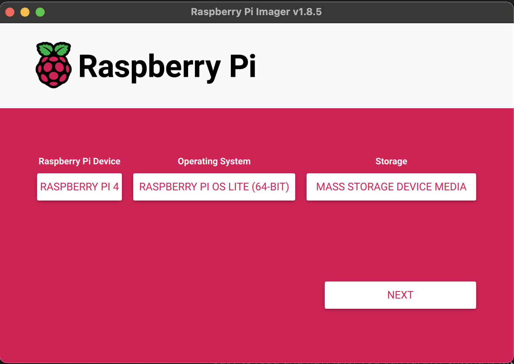
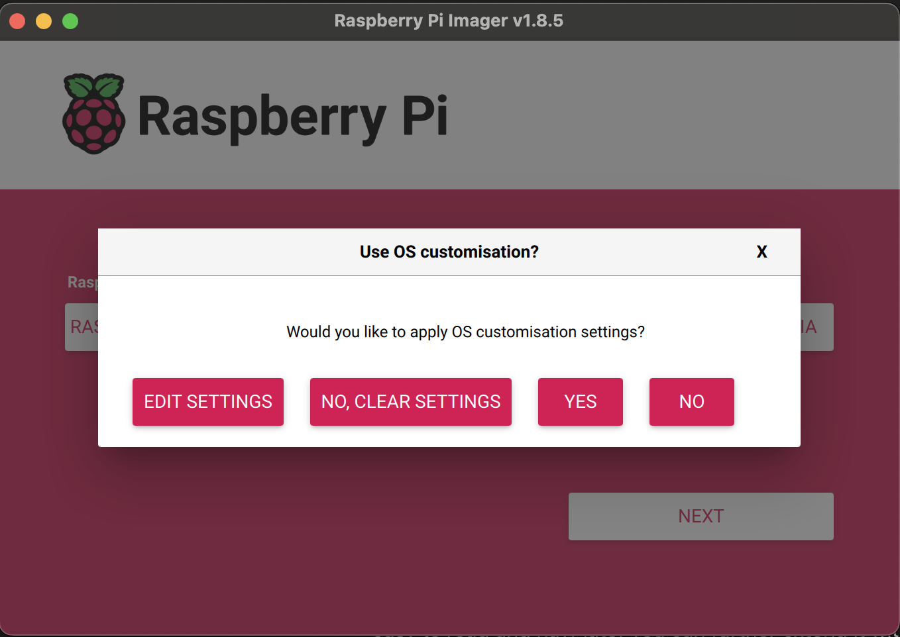

# Run DeepSeek R1 locally on a Raspberry Pi 4 (or any other Linux machine) with llama.cpp

## Introduction

Lately, **DeepSeek R1** has been creating a massive buzz in the AI community with it's revolutionary reasoning capabilities and highly cheap development costs. This groundbreaking LLM isn’t just another cloud-based closed-source model; it’s a completely **open-source** reasoning model that leverages pure reinforcement learning to achieve impressive results on complex tasks. With a 671-billion-parameter Mixture-of-Experts architecture, DeepSeek R1 demonstrates remarkable performance on mathematical, coding, and reasoning benchmarks, often matching or even surpassing mainstream proprietary models such as OpenAI's o1 and Anthropic's Claude 3.5 Sonnet!


In this post, I’ll show you how to run DeepSeek R1 on a **Raspberry Pi 4**, proving that even a tiny computer can unleash the potential of advanced AI. This local deployment means no data sharing with external companies, no internet dependency, and complete control over your own LLM—making it an ideal solution for privacy-conscious users and hobby users. Let’s dive into how to bring this high-performing model right to your hands!

## Overview

As we discussed DeepSeek R1 is renowned for its exceptional reasoning capabilities, achieved through cutting-edge reinforcement learning. While the original model features an enormous 671-billion-parameter architecture, running it locally isn’t feasible on modest hardware like a Raspberry Pi 4.

To bridge this gap, we will use a distilled version: **DeepSeek-R1-Distill-Qwen-1.5B**. In simple terms, **model distillation** is a process where the knowledge from a large, powerful model (often called the teacher) is transferred to a much smaller, more efficient model (the student). To learn more about distillation you can read [this great article](https://labelbox.com/guides/model-distillation/).

### Why bother?

You might be asking why do we need to run it locally, let alone a Raspberry Pi? Running an LLM locally creates an opportunity for a user(s) to completely control and manage the data they produce. Without relying on external servers, you can ensure that sensitive information remains private, easily customize the model’s behavior to your specific needs, and avoid potential downtime or latency issues associated with cloud services. This level of control not only enhances security but also empowers developers and hobbyists to experiment and innovate in a truly independent environment—all on a cost-effective, compact device like the Raspberry Pi 4.

**Now let's dive into technical details.**

## Prerequisites

1. Hardware requirements

   - Raspberry Pi with at least 4GB RAM (Pi 4 or more powerful models)
   - Micro SD card of at least 32GB
   - Keyboard and monitor (optional)

2. Software Requirements

   - [Raspberry Pi Imager](https://www.raspberrypi.com/software/): We will install Raspberry Pi OS **Lite** to our Raspberry
   - [cmake](https://cgold.readthedocs.io/en/latest/first-step/installation.html): for building llama.cpp

3. Background Knowledge
   - Familiarity with Linux terminal

## Environment Setup

I am using Raspbbery Pi 4 (4GB RAM) as my own device to run the DeepSeek-R1-Distill-Qwen-1.5B model. You will be good to go for any model newer than Pi 4 and have more than 4GB RAM with this guide.

### Install Raspberry Pi OS **Lite** (64-bit)

For our case we will use the **Lite** version of Raspberry Pi OS since we do not want to lose any computational resources for Desktop Environment services. Follow [this guide](https://www.raspberrypi.com/documentation/computers/getting-started.html#raspberry-pi-imager) for installation steps.

### Connection to Pi

We will use terminal to start inference on our Pi. You can either [connect to Pi via SSH](https://www.raspberrypi.com/documentation/computers/remote-access.html#ssh) or use keyboard and a monitor to enter commands I will describe.

### Building llama.cpp

llama.cpp is a standalone, low-level C++ implementation that minimizes overhead by eliminating the extra abstraction layer that Ollama introduces for automation and model management. This results in faster, more efficient inference and greater flexibility when deploying on resource-constrained devices like the Raspberry Pi 4. First we need to build llama.cpp so that we are able to use it.

1. Get llama.cpp

   ```shell
   git clone https://github.com/ggerganov/llama.cpp
   cd llama.cpp
   ```

2. Install OpenBLAS

   ```shell
   sudo apt-get install libopenblas-dev
   ```

3. Build llama.cpp and add to PATH for your machine (might take up to 10min)

   ```shell
   cmake -B build -DGGML_BLAS=ON -DGGML_BLAS_VENDOR=OpenBLAS
   cmake --build build --config Release
   sudo cp "$(pwd)/build/bin/llama-cli" /usr/local/bin/llama-cli
   sudo cp "$(pwd)/build/bin/llama-server" /usr/local/bin/llama-server
   ```

### Download and Run Deepseek R1 1.5B

We will use a [4-bit quantized GGUF version of Deepseek R1](https://huggingface.co/bartowski/DeepSeek-R1-Distill-Qwen-1.5B-GGUF/blob/main/DeepSeek-R1-Distill-Qwen-1.5B-Q4_K_M.gguf)

Download model with:

```shell
wget -O models/DeepSeek-R1-Distill-Qwen-1.5B-Q4_K_M.gguf https://huggingface.co/bartowski/DeepSeek-R1-Distill-Qwen-1.5B-GGUF/resolve/main/DeepSeek-R1-Distill-Qwen-1.5B-Q4_K_M.gguf
```

3-2-1 GO!

```shell
llama-cli -m models/DeepSeek-R1-Distill-Qwen-1.5B-Q4_K_M.gguf \
       -n 1024 \
       --ctx-size 4096 \
       -b 32 \
       --threads 4 \
       --no-mmap \
       --mlock
```

This command loads the model and lets you get answers directly inside Terminal. On Raspberry Pi 4 with a fan it should give approximately 3.5-4 Token/second (10-14 character/second) performance.

(GIF demonstrates 3x speedup)


### Use with a Web UI and as server

Using llama.cpp's llama-server command we can easily serve an [OpenAI API compatible HTTP server](https://github.com/ggerganov/llama.cpp?tab=readme-ov-file#llama-server) and even a web interface to use it!

Simply run:

```shell
llama-server -m models/DeepSeek-R1-Distill-Qwen-1.5B-Q4_K_M.gguf \
       --host 0.0.0.0 \
       -n 1024 \
       --ctx-size 4096 \
       -b 32 \
       --threads 4 \
       --no-mmap \
       --mlock
```

This will create a local server inside Raspbbery Pi 4. If you are on the same network with the Pi you can simply enter `http://raspberrypi.local:8080` in your browser and start using DeepSeek R1 with a web interface!



Here are meanings of parameters we used, you can also check other parameters [here](https://github.com/ggerganov/llama.cpp/tree/master/examples/server):

- `-n 1024`: Limits token generation to reduce computational load on the Pi’s modest CPU.
- `--ctx-size 4096`: Sets the context length to balance useful context with the Pi’s memory limits.
- `-b 32`: Reduces the batch size to minimize memory and processing overhead for faster inference.
- `--threads 4`: Caps the CPU threads to efficiently use the Raspberry Pi 4’s quad-core processor.
- `--no-mmap`: Disables memory mapping to avoid slow I/O on the Pi’s SD card or USB storage.
- `--mlock`: Locks the model in RAM to prevent swapping, improving performance on limited memory systems.

## Conclusion

In summary, we've demonstrated that even a modest Raspberry Pi 4 can power an advanced LLM like DeepSeek R1 using llama.cpp. By leveraging the distilled DeepSeek-R1-Distill-Qwen-1.5B model and optimizing system parameters, you gain complete local control, enhanced privacy, and cost-effective, efficient inference. This setup opens exciting opportunities for hobbyists and developers to experiment with cutting-edge AI in a fully independent environment.

<!--
   Here are the steps to install Raspberry Pi OS **Lite**:

   1. Connect your SD Card to your computer
   2. Select the Raspberry Pi Device of your own (mine is Pi 4)
   3. Choose OS -> Raspberry Pi OS (Other) -> Rapberry Pi OS Lite (64-bit)
   4. Select your SD Card
   

---

If you will connect with SSH follow 5-6-7-8:

5.  After you click `Next` you will be prompted with this screen select `Edit Settings`
    
6.  Set your hostname to your liking, this will be used later for connecting via ssh
7.  If you will connect your Pi to internet via Wi-Fi enter connection details
8.  Click `Services` and select `Enable SSH` with `Use Password Authentication`

---

9.  Save the configurations

Pi OS imager will start installing the OS to your SD Card.
-->
